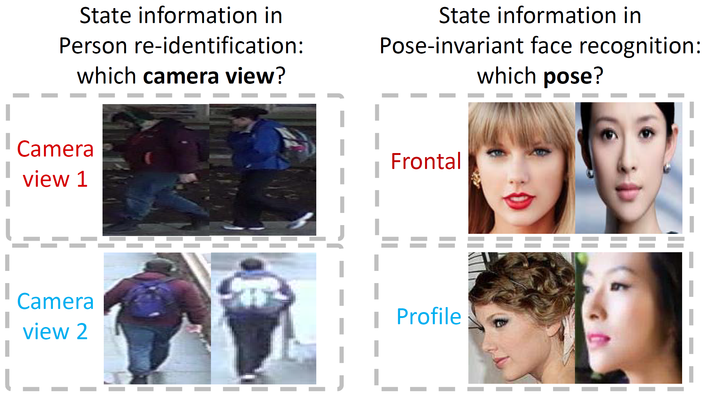

# Under construction

## [Weakly supervised discriminative feature learning with state information for person identification](https://kovenyu.com/papers/2020_CVPR_weakly.pdf)



This repo contains the source code for our CVPR'20 work
**Weakly supervised discriminative feature learning with state information for person identification** 
([paper](https://kovenyu.com/papers/2020_CVPR_weakly.pdf).
Our implementation is based on Pytorch.
In the following is an instruction to use the code
to train and evaluate our model.


### Prerequisites
1. [Pytorch 1.0.0](https://pytorch.org/)
2. Python 3.6+
3. Python packages: numpy, scipy, pyyaml/yaml, h5py

### Data and pretrained weights
Please download the Market/Duke/Multi-PIE/CFP dataset from
[BaiduPan](https://pan.baidu.com/s/1O0s_dJcbkku6T0MwlLQecw) with
password "tih8" or [GoogleDrive](https://drive.google.com/open?id=1VnJF6Hsj7oV4Bb5nnP7SoJKh2ID8xhD6) 
(Multi-PIE and CFP on [Mega](https://mega.gz)),
as well as the pretrained ResNet50 weights,
and put all of them into */data/*.

### Run the code

Please enter the main folder, and run
```bash
python src/main.py --gpu 0,1,2,3 --save_path runs/debug
```
on Market dataset,
where "0,1,2,3" specifies your gpu IDs.
If you are using gpus with 12G memory, you need 4 gpus to run 
in the default setting (batchsize=384).
Note that small batch size is NOT recommended as it increases the variance in estimating in-batch feature distributions.
If you have to set a small batch size, please lower the learning rate as the gradient
would be stronger for a smaller batch size.
Please also note that since I load the whole datasets into cpu memory and parallelize computation,
you need at least 12G RAM memory for Market. Hence I recommend you run it on a server.

For Duke dataset, run
```bash
python src/main.py --gpu 0,1,2,3 --save_path runs/debug_duke
```
For Multi-PIE:
```bash
python src/main_mpie.py --gpu 0,1,2,3 --save_path runs/debug_mpie
```
For CFP:
```bash
python src/main_cfp.py --gpu 0,1,2,3 --save_path runs/debug_cfp
```

### Main results
We find our method can achieve performances that are comparable to standard supervised fine-tuning performances on Duke, MultiPIE and CFP datasets.
#### Duke-REID
Method |Rank-1|Rank-5|MAP
-|-|-|-
Supervised fine-tune| 75.0|85.0|57.2
Pretrained| 43.1| 59.2| 28.8
Ours| 72.1|83.5| 53.8
#### Multi-PIE
Method| avg| 0&deg;| 15&deg;| 30&deg;| 45 &deg;| 60&deg;
-|-|-|-|-|-|-
Supervised fine-tune| 98.2| 99.7|99.4|98.8|98.1|95.7
Pretrained| 88.7| 98.5| 97.5| 93.7| 89.7| 71.2
Ours| 97.1| 99.1| 98.9| 98.3| 96.8| 93.1
#### CFP
Method| Accuracy| EER (lower better)| AUC
-|-|-|-
Supervised fine-tune| 95.5| 4.7| 98.8
Pretrained| 92.9| 7.4| 97.8
Ours| 95.5| 4.7| 98.8

### Reference

If you find our work helpful in your research,
please kindly cite our paper:

Hong-Xing Yu and Wei-Shi Zheng, "Weakly supervised discriminative feature learning with state information for person identification",
In CVPR, 2020.

bib:
```
@inproceedings{yu2020weakly,
  title={Weakly supervised discriminative feature learning with state information for person identification},
  author={Yu, Hong-Xing and Zheng, Wei-Shi},
  year={2020},
  booktitle={IEEE International Conference on Computer Vision and Pattern Recognition (CVPR)},
}
```

### Contact
If you have any problem please email me at xKoven@gmail.com as
I rarely look at issues.